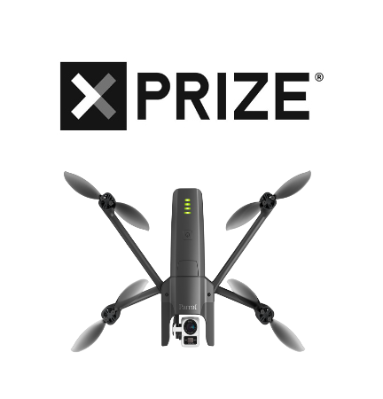

# UAS Software Control Interface - ANAFI 4K

<p align="center">
    
</p>

## Contributing to the project

1. Clone the Project unto your local Repo

2. Solve intended bug or new feature by creating branch from main repo

3. Make pull request

4. The repo maintainers will review your code and give you feedback

5. If code is approved merge code into code base

## Background
The aim of this project is to build an interface to help reduce the likelihood of collisions with objects when a drone is launched into a forest. A “critic” is required to give basic instructions to the user controlling the drone through an interface. This interface allows a less experienced pilot to leverage object-avoidance techniques possessed by more experienced pilots to help prevent a collision. This reduces the likelihood of damage to the drone in flight or the total loss of the drone. 
 
This project is important because it makes collisions leading to damage to the drone less likely, which also reduces the chance that the drone will need to be repaired, which can be an expensive and tedious process that would be made even more difficult in the rainforest. In addition this would allow for smoother operations of drones in the rainforest environment while ecological data is collected. Additionally, the project is the first step in building autonomy into the overall XPrize drone project.
 
There are no current solutions to the problem we are trying to solve as it is very particular to the drone development platform that is being used for the project: the Parrot ANAFI drone and Olympe. The latter is a programming interface that allows users to control the drone using scripts written in Python. It also allows users to control virtualized drones in simulated environments such as Sphinx, which is also officially supported by Parrot. This ensures that our team will have continuity in our work even if some of us are unable to have Parrot ANAFI drones shipped to our current residence. 
 
Failure to implement the solution proposed by this group could lead to the total loss of the drone during the demonstration phase of the competition if a collision occurs between the drone and another object, compromising the entire project effort’s work and ability to excel in the competition.

## Using the interface 
### Dependencies 
* Your computer must be running a distribution of Linux to run both the control interface and the 
simulated flight environment.
* A native installation of Linux is strongly recommended for those who wish to use simulated flight 
environment due to the hardware-intensive nature of Sphinx.
* Ensure that [Olympe](https://developer.parrot.com/docs/olympe/installation.html) has been installed before using the controller interface.
* Ensure that [Sphinx](https://developer.parrot.com/docs/sphinx/installation.html) has been installed
before using the simulated flight environment to test the controller interface. 
### Run 
***Controller Interface*** </br>
In a new shell instance, execute 
``` 
source ~/code/parrot-groundsdk/./products/olympe/linux/env/shell 
```
to start the Olympe environment. This is necessary to start the controller interface. </br> </br>
In the same shell instance that is in the same directory as ```control_gui.py```, execute 
```
python3 control_gui.py
```
to start the controller interface. </br> 

***Simulated Flight Environment*** </br>
In a new shell instance, execute 
```
sudo systemctl start firmwared.service
```
followed by 
```
sphinx /opt/parrot-sphinx/usr/share/sphinx/drones/anafi4k.drone
```
to start the simulation.
