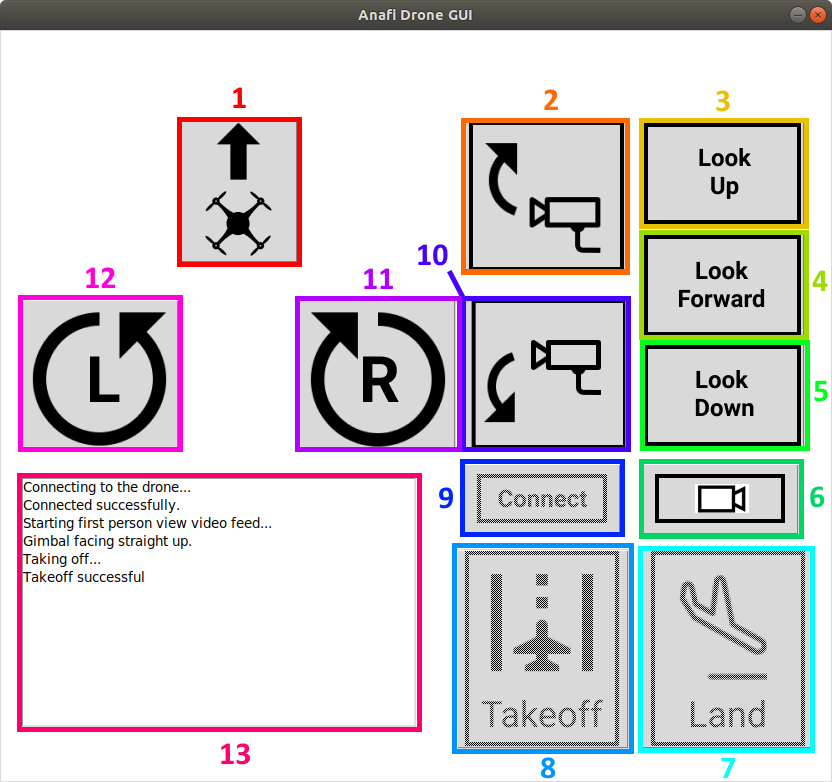

# UAS Software Control Interface - ANAFI 4K

<p align="center">
    
</p>

## Contributing to the project

1. Clone the Project unto your local Repo

2. Solve intended bug or new feature by creating branch from main repo

3. Make pull request

4. The repo maintainers will review your code and give you feedback

5. If code is approved merge code into code base

## Background
The aim of this project is to build an interface to help reduce the likelihood of collisions with objects when a drone is launched into a forest. A “critic” is required to give basic instructions to the user controlling the drone through an interface. This interface allows a less experienced pilot to leverage object-avoidance techniques possessed by more experienced pilots to help prevent a collision. This reduces the likelihood of damage to the drone in flight or the total loss of the drone. 
 
This project is important because it makes collisions leading to damage to the drone less likely, which also reduces the chance that the drone will need to be repaired, which can be an expensive and tedious process that would be made even more difficult in the rainforest. In addition this would allow for smoother operations of drones in the rainforest environment while ecological data is collected. Additionally, the project is the first step in building autonomy into the overall XPrize drone project.
 
There are no current solutions to the problem we are trying to solve as it is very particular to the drone development platform that is being used for the project: the Parrot ANAFI drone and Olympe. The latter is a programming interface that allows users to control the drone using scripts written in Python. It also allows users to control virtualized drones in simulated environments such as Sphinx, which is also officially supported by Parrot. This ensures that our team will have continuity in our work even if some of us are unable to have Parrot ANAFI drones shipped to our current residence. 
 
Failure to implement the solution proposed by this group could lead to the total loss of the drone during the demonstration phase of the competition if a collision occurs between the drone and another object, compromising the entire project effort’s work and ability to excel in the competition.

## Control Interface Diagram
<p align="center">
    
</p>

### 1. Move forward
The drone will move straight forward relative to the plane of the drone if the camera gimbal is tilted at most either 10% (relative to its available range of motion) above or below the plane of the drone. If the camera gimbal is facing straight up relative to the plane of the drone, the drone will move upwards by increasing throttle. If the camera gimbal is facing straight down relative to the plane of the drone, the drone will move downwards by decreasing throttle. 
### 2. Tilt gimbal up
The camera gimbal will tilt relative to the plane of the drone's frame up by 10% of its total available range of motion. If the camera is already facing straight up relative to the plane of the drone's frame, the gimbal will not move.
### 3. Tilt gimbal straight up
The camera gimbal will tilt straight up relative to the plane of the drone's frame if it is not already in that position. 
### 4. Tilt gimbal straight forward 
The camera gimbal will tilt straight forward relative to the plane of the drone's frame if it is not already in that position.
### 5. Tilt gimbal straight down
The camera gimbal will tilt straight down relative to the plane of the drone's frame if it is not already in that position. 
### 6. Start first person view (FPV)
A separate window will open to display the live video feed from the drone for first person view operation. The window can be resized. This button will have no effect if the FPV window is already open.
### 7. Land drone 
The drone will slowly lower itself until it reaches the ground below it. This button will have no effect unless the drone is flying and the camera is facing straight down relative to the plane of the drone's frame.  
### 8. Takeoff
The drone rotors will start and the drone will rise to about three feet in the air and hover in that position. This button will have no effect unless the drone is not in the air and the camera is facing straight up relative to the plane of the drone's frame.
### 9. Connect to drone
The controller will connect to the drone after it has been turned on or initialized in Sphinx. If a physical drone is being used, be sure to connect to the Wi-Fi network created by the drone first. Failure to do so will require the interface to be restarted if the button is pressed. 
### 10. Tilt gimbal camera down
The camera gimbal will tilt down relative to the drone's frame by 10% of its total available range of motion. If the camera is already facing straight down relative to the plane of the drone's frame, the gimbal will not move. 
### 11. Turn right
The drone will turn left by about 10 degrees. 
### 12. Turn left
The drone will turn right by about 10 degrees. 
### 13. Status messages
Messages related to the current state of the drone will be provided whenever a button on the interface is pressed, assuming that button may be used at a given time. If the box becomes filled, scroll down after clicking inside of the box to see new messages.

## Using the interface [(Live Demo)](https://youtu.be/55FwVCVg6VY)
### Dependencies 
* Your computer must be running a distribution of Linux to run both the control interface and the 
simulated flight environment.
* A native installation of Linux is strongly recommended for those who wish to use simulated flight 
environment due to the hardware-intensive nature of Sphinx.
* Ensure that [Olympe](https://developer.parrot.com/docs/olympe/installation.html) has been installed before using the controller interface.
* Ensure that [Sphinx](https://developer.parrot.com/docs/sphinx/installation.html) has been installed
before using the simulated flight environment to test the controller interface. 
### Run 
***Controller Interface*** </br>
In a new shell instance, execute 
``` 
source ~/code/parrot-groundsdk/./products/olympe/linux/env/shell 
```
to start the Olympe environment. This is necessary to start the controller interface. </br> </br>
In the same shell instance that is in the same directory as ```control_gui.py```, execute 
```
python3 control_gui.py
```
to start the controller interface. </br> 

***Simulated Flight Environment*** </br>
In a new shell instance, execute 
```
sudo systemctl start firmwared.service
```
followed by 
```
sphinx /opt/parrot-sphinx/usr/share/sphinx/drones/anafi4k.drone
```
to start the simulation.
